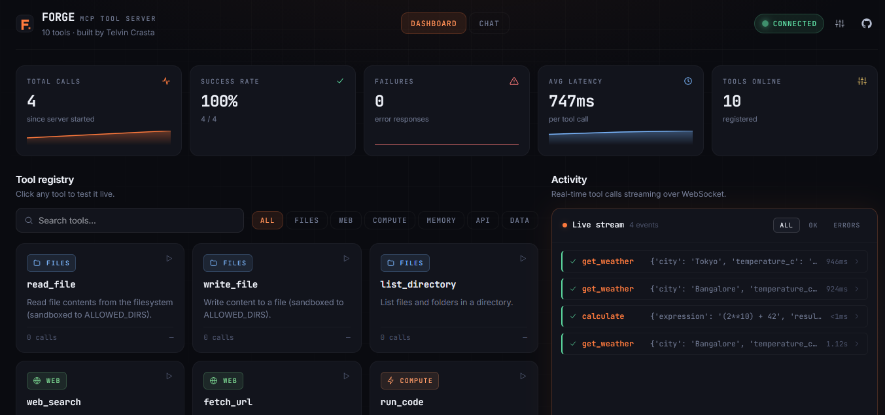
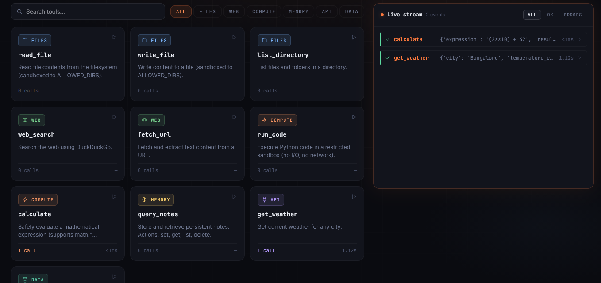
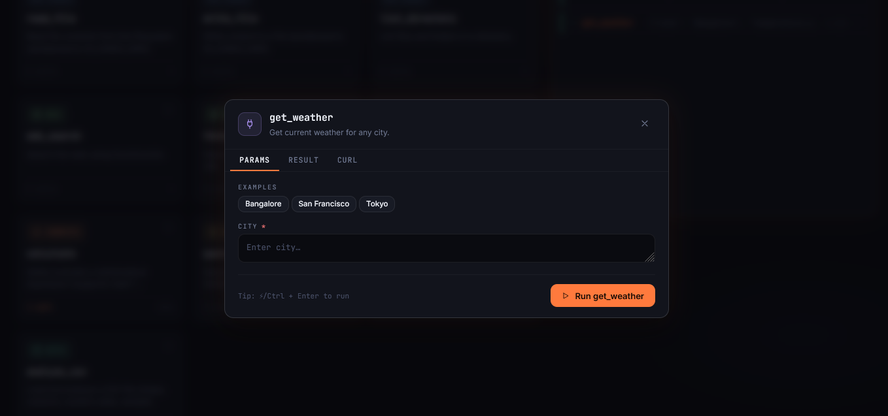
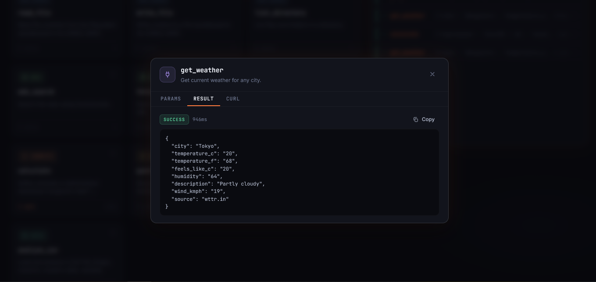
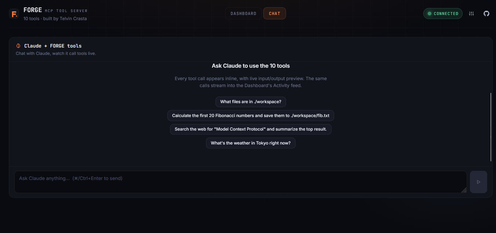

<div align="center">

# 🔥 FORGE

### A Universal MCP Tool Server — 10 Typed Tools, One Connection, Full Live Visibility

[](https://www.python.org/)
[](https://fastapi.tiangolo.com/)
[](https://docs.pydantic.dev/)
[](https://react.dev/)
[](https://modelcontextprotocol.io/)
[](https://github.com/crastatelvin/forge-mcp-server/actions)
[](LICENSE)

<br/>

> **FORGE** is a production-grade custom implementation of Anthropic's [Model Context Protocol](https://modelcontextprotocol.io/) — the open standard for connecting LLMs to external tools. One connection exposes **ten typed, sandboxed tools** across filesystem, web, compute, memory, weather, and data analysis. Every call is validated by **Pydantic**, dispatched through **FastAPI**, and streamed live over **WebSocket** to a premium **React dashboard** that lets you test tools, inspect history, and watch Claude orchestrate them in a built-in chat tab.

<br/>

   

<br/>

### 🌐 Live Deployment

| Surface | URL | Status |
|---|---|---|
| 🖥️ **Dashboard** | [forge-mcp-server.vercel.app](https://forge-mcp-server.vercel.app) | Live |
| 🔌 **API Server** | [forge-mcp-server.onrender.com](https://forge-mcp-server.onrender.com) | Live |
| 📚 **Interactive Docs** | [/docs (Swagger UI)](https://forge-mcp-server.onrender.com/docs) | Live |
| ❤️ **Health** | [/health](https://forge-mcp-server.onrender.com/health) | `{"status":"ok"}` |

</div>

---

## 📋 Table of Contents

- [Overview](#-overview)
- [Application Preview](#-application-preview)
- [Live Demo](#-live-demo)
- [Features](#-features)
- [Architecture](#-architecture)
- [Tech Stack](#-tech-stack)
- [Project Structure](#-project-structure)
- [The Ten Tools](#-the-ten-tools)
- [Installation](#-installation)
- [Usage](#-usage)
- [API Reference](#-api-reference)
- [Dashboard Tour](#-dashboard-tour)
- [Claude Chat Integration](#-claude-chat-integration)
- [Configuration](#-configuration)
- [Testing & CI](#-testing--ci)
- [Deployment](#-deployment)
- [Security Notes](#-security-notes)
- [Design Decisions](#-design-decisions)
- [Contributing](#-contributing)
- [License](#-license)

---

## 🧠 Overview

The **Model Context Protocol** is Anthropic's answer to the "LLMs can't do anything" problem — a single standard JSON-over-HTTP/WebSocket shape that any model can speak to any tool. Most MCP tutorials stop at `hello_world`. **FORGE goes the distance:** ten real, typed, sandboxed tools behind a proper auth + rate-limit middleware, with an interactive dashboard, server-proxied Claude integration, 28 tests in CI, and one-click Render + Vercel deployment.

Users can:

- Call any of **10 production-ready tools** over HTTP, WebSocket, or MCP's native `/mcp/call` shape
- Browse the **interactive Swagger UI** at `/docs` (fully typed by Pydantic)
- Open the **React dashboard** and watch every tool call stream live — with status, duration, params, and full JSON results
- **Test any tool interactively** from the browser (Params / Result / cURL tabs, with one-click preset examples)
- **Chat with Claude** in the built-in Chat tab and watch tool calls render inline as Claude orchestrates them *(optional — works once an `ANTHROPIC_API_KEY` is configured server-side)*
- Secure it behind a **bearer API key** with one env var, and **lock CORS** to a single origin
- Deploy the whole thing on free tiers — **Render** for the server, **Vercel** for the dashboard

The backend is built with **FastAPI + Pydantic 2** and the frontend with **React 18 + Framer Motion + Recharts**. The `/chat` endpoint is **server-proxied**: the Anthropic API key never reaches the browser. Every request is rate-limited by a sliding-window per-IP limiter; every file operation is sandboxed to `ALLOWED_DIRS`; every Python execution runs under a token blocklist with restricted builtins.

---

## 🖼️ Application Preview

<div align="center">

### Dashboard — Live Stats, Tool Registry, and WebSocket Activity Feed



*Top: five live KPI cards with sparklines. Left: every tool grouped by category with search + filter chips. Right: every tool call streamed in real time over WebSocket.*

<br/>

### Tool Registry — 10 Typed, Sandboxed Tools



*`FILES · WEB · COMPUTE · MEMORY · API · DATA` — click any card to open the interactive tester.*

<br/>

### Interactive Tool Tester — Params, Result, and cURL in One Modal

<table>
<tr>
<td width="50%" valign="top">

**Params tab** — preset example chips, typed inputs, `Ctrl+Enter` to run.



</td>
<td width="50%" valign="top">

**Result tab** — success pill, duration, copyable JSON response.



</td>
</tr>
</table>

<br/>

### Claude Chat — Tool-Use Loop With Inline Tool Cards



*The chat tab is wired end-to-end via a server-proxied SSE endpoint. Pre-written prompts on the empty state make it easy to see Claude orchestrate FORGE's tools the moment an Anthropic key is configured.*

</div>

---

## 🌐 Live Demo

FORGE is deployed and publicly reachable right now. Everything below works in your browser with zero local setup:

| What to try | URL |
|---|---|
| Open the dashboard | <https://forge-mcp-server.vercel.app> |
| Test a tool in the browser | Click any card → fill params → hit play |
| See all 10 tools typed in Swagger | <https://forge-mcp-server.onrender.com/docs> |
| Hit a tool from the CLI | `curl https://forge-mcp-server.onrender.com/health` |
| Read the raw tool registry (MCP shape) | <https://forge-mcp-server.onrender.com/mcp/tools> |

> The dashboard is protected by a bearer key. To make calls from your own browser session, click the **gear icon** in the top-right, paste your `FORGE_API_KEY`, and save — it's stored in browser localStorage only.

---

## ✨ Features

| Feature | Description |
|---|---|
| 🗂️ **10 Typed Tools** | `read_file`, `write_file`, `list_directory`, `web_search`, `fetch_url`, `run_code`, `calculate`, `query_notes`, `get_weather`, `analyze_csv` — all validated by Pydantic |
| 🔐 **Optional Bearer Auth** | Set `FORGE_API_KEY` and every request needs `Authorization: Bearer <key>`. Public paths (`/health`, `/docs`) bypass auth so monitoring works |
| 🛡️ **Sandboxed Filesystem** | File tools resolve paths and verify `Path.relative_to(ALLOWED_DIRS)` — no traversal, no surprises |
| 🧪 **Safe Code Execution** | `run_code` runs under restricted builtins + a token blocklist. `calculate` is an AST walker that refuses name lookups entirely |
| ⏱️ **Sliding-Window Rate Limiter** | Per-IP, configurable, in-memory. Returns `429 Retry-After` when tripped |
| 🔴 **Live WebSocket Stream** | Every tool call broadcasts to `/ws` — the dashboard renders it as a color-coded row within ~50ms |
| 📖 **Full OpenAPI / Swagger** | Pydantic models produce an interactive `/docs` that actually shows the shape of every tool |
| 🤖 **MCP-Compatible Endpoints** | `/mcp/tools` and `/mcp/call` match Anthropic's MCP shape with proper `inputSchema` JSON Schemas |
| 💬 **Built-in Claude Chat Tab** | Server-proxied `/chat` SSE endpoint runs Claude's full tool-use loop. Tool calls render inline in the chat UI. Key never leaves the server |
| 🎨 **Premium React Dashboard** | Live stats strip, tool registry with category filters, interactive tool tester (Params / Result / cURL), per-category bar chart, live call feed, hash-routed tabs |
| 📁 **Hot-Editable Tool Registry** | Add a tool: write one function, add one Pydantic model, add one line to `TOOL_REGISTRY`. Dashboard, `/docs`, MCP, and CI pick it up automatically |
| 🧪 **28-Test Pytest Suite** | Tool happy paths, sandbox escape attempts, auth (401/403/public bypass), CORS preflight, rate limiter. Green in GitHub Actions on every push |
| 🎯 **Ruff Lint + Format** | Enforced in CI. The whole server is < 1000 lines of clean Python |
| 🚀 **One-Click Deploy** | `render.yaml` + `vercel.json` included. Full walkthrough in [`DEPLOY.md`](./DEPLOY.md) |

---

## 🏗️ Architecture

```
┌─────────────────────────────────────────────────────────────────────┐
│                  Browser / React 18 Dashboard                       │
│                                                                     │
│  ┌────────────┐  ┌──────────────┐  ┌──────────────┐  ┌───────────┐  │
│  │ StatsStrip │  │ ToolGrid     │  │ LiveCallFeed │  │ ChatPanel │  │
│  │ (live KPIs │  │ (10 typed    │  │ (WebSocket   │  │ (Claude + │  │
│  │  + spark-  │  │  tools, one- │  │  stream of   │  │  inline   │  │
│  │  lines)    │  │  click test) │  │  tool calls) │  │  tool use)│  │
│  └─────┬──────┘  └──────┬───────┘  └──────┬───────┘  └─────┬─────┘  │
│        │                │                 │                │        │
│        │ Axios +        │ POST /call/:name│    WS /ws      │ SSE    │
│        │ Bearer key     │ (typed schema)  │ (bcast frames) │ /chat  │
└────────┼────────────────┼─────────────────┼────────────────┼────────┘
         │                │                 │                │
┌────────▼────────────────▼─────────────────▼────────────────▼────────┐
│                        FastAPI + Pydantic 2                         │
│                                                                     │
│  ┌──────────────────────┐  ┌────────────────────┐  ┌──────────────┐ │
│  │  BearerAuthMiddleware│  │  CORSMiddleware    │  │ RateLimiter  │ │
│  │  (skips OPTIONS +    │  │  (locked to single │  │ (sliding     │ │
│  │   public paths)      │  │   dashboard origin)│  │  window/IP)  │ │
│  └──────────────────────┘  └────────────────────┘  └──────────────┘ │
│                                                                     │
│  ┌───────────────────────────────────────────────────────────────┐  │
│  │                      Typed Tool Dispatch                      │  │
│  │                                                               │  │
│  │   /tools/<name>   ──►  REQUEST_MODELS[name].validate()  ─┐    │  │
│  │   /call/<name>    ──►  TOOL_REGISTRY[name].fn(params)    │    │  │
│  │   /mcp/call       ──►  log + broadcast over /ws          │    │  │
│  │   /chat (SSE)     ──►  Claude tool-use loop (server-side)│    │  │
│  └──────────────────────────────────────────────────────────┴────┘  │
│                                                                     │
│  ┌──────────────┐ ┌────────────┐ ┌────────────┐ ┌────────────────┐  │
│  │ file_tools   │ │ web_tools  │ │compute_tools│ │ data_tools    │  │
│  │ • sandboxed  │ │ • DuckDuck │ │ • AST eval  │ │ • pandas CSV  │  │
│  │   pathlib    │ │ • httpx +  │ │ • restricted│ │   analyzer    │  │
│  │ • size caps  │ │   BS4      │ │   builtins  │ │ • JSON notes  │  │
│  └──────────────┘ └────────────┘ └─────────────┘ └───────────────┘  │
│                                                                     │
│  ┌─────────────────────┐  ┌──────────────────┐  ┌────────────────┐  │
│  │  api_tools          │  │  logger.py       │  │  storage/      │  │
│  │  • OpenWeatherMap   │  │  thread-safe     │  │  notes.json    │  │
│  │  • wttr.in fallback │  │  deque + JSONL   │  │  tool_calls    │  │
│  └─────────────────────┘  └──────────────────┘  └────────────────┘  │
└─────────────────────────────────────────────────────────────────────┘
                                │
                                ▼
          ┌──────────────────────────────────────────┐
          │  Optional: Anthropic API (for /chat)     │
          │  claude-sonnet-4-5 with tool-use loop     │
          └──────────────────────────────────────────┘
```

**Request lifecycle**

1. Browser/Claude sends `POST /call/calculate` with `Authorization: Bearer …`
2. **CORS** → **Auth** → **Rate limiter** middleware chain
3. Generic `/call/{name}` looks up the Pydantic model in `REQUEST_MODELS`, validates, and dispatches
4. Tool function runs sandboxed; result wrapped in `ToolCallResponse`
5. Entry logged to in-memory deque + JSONL file, then broadcast to every open WebSocket
6. Dashboard's `LiveCallFeed` renders the new row instantly

---

## 🛠️ Tech Stack

| Layer | Technology |
|---|---|
| **Backend** | FastAPI 0.115, Pydantic 2, Uvicorn, Python 3.11+ |
| **Validation** | One Pydantic model per tool; auto-generates OpenAPI + MCP `inputSchema` |
| **Real-time** | Native FastAPI WebSockets (dashboard feed) + Server-Sent Events (`/chat`) |
| **Frontend** | React 18, Framer Motion, Recharts, Axios, custom design tokens (no Tailwind) |
| **Auth** | Bearer token middleware (env-driven; off by default in dev, on in prod) |
| **Upstream APIs** | DuckDuckGo Search, httpx, BeautifulSoup4, wttr.in, optional OpenWeatherMap & Anthropic |
| **Data** | pandas + numpy for `analyze_csv`; JSON file for `query_notes` |
| **Testing** | pytest 8 + pytest-asyncio (backend), CRA build check (frontend) |
| **Lint/Format** | ruff (E/F/I/W/B/UP + `ruff format`) |
| **CI/CD** | GitHub Actions — lint, format-check, pytest, dashboard prod build on every push |
| **Deploy** | `render.yaml` (backend, Python web service), `vercel.json` (dashboard, CRA preset) |

---

## 📁 Project Structure

```
forge-mcp-server/
│
├── mcp-server/                      # FastAPI MCP tool server
│   ├── server.py                    # Routes: /tools, /call, /mcp, /chat, /ws
│   ├── schemas.py                   # One Pydantic model per tool + chat
│   │
│   ├── tools/
│   │   ├── file_tools.py            # read_file, write_file, list_directory (sandboxed)
│   │   ├── web_tools.py             # web_search (DuckDuckGo), fetch_url (httpx+bs4)
│   │   ├── compute_tools.py         # run_code (restricted exec), calculate (AST)
│   │   ├── data_tools.py            # query_notes (KV), analyze_csv (pandas)
│   │   └── api_tools.py             # get_weather (OpenWeatherMap / wttr.in)
│   │
│   ├── middleware/
│   │   ├── auth.py                  # BearerAuthMiddleware (skips OPTIONS + public)
│   │   ├── logger.py                # Thread-safe in-memory deque + JSONL sink
│   │   └── rate_limiter.py          # Sliding-window per-IP limiter
│   │
│   ├── tests/                       # 28 pytest tests
│   │   ├── conftest.py              # Isolated workspace + authed client fixtures
│   │   ├── test_meta.py             # /health, /tools, /mcp, /docs
│   │   ├── test_tools.py            # Every tool, happy + error paths
│   │   ├── test_auth.py             # 401/403/public/CORS preflight regression
│   │   └── test_rate_limiter.py     # Window trips + bypass when disabled
│   │
│   ├── storage/                     # Runtime state (gitignored)
│   ├── workspace/                   # ALLOWED_DIRS scratch space
│   ├── requirements.txt             # Runtime deps
│   ├── requirements-dev.txt         # + pytest, ruff
│   ├── ruff.toml  pytest.ini
│   ├── Dockerfile                   # Production container
│   └── .env.example
│
├── dashboard/                       # React dashboard
│   ├── src/
│   │   ├── pages/
│   │   │   └── DashboardPage.jsx    # Tabs: Dashboard / Chat
│   │   ├── components/
│   │   │   ├── Header.jsx           # Logo + tabs + settings + GH
│   │   │   ├── StatsStrip.jsx       # 5 KPI cards with sparklines
│   │   │   ├── ToolGrid.jsx         # Search + category filter + skeletons
│   │   │   ├── ToolCard.jsx         # Category-colored, click to test
│   │   │   ├── ToolTester.jsx       # Modal: Params / Result / cURL tabs
│   │   │   ├── LiveCallFeed.jsx     # Status-filtered, inline expansion
│   │   │   ├── UsageChart.jsx       # Per-category bar chart (Recharts)
│   │   │   ├── ChatPanel.jsx        # Claude chat w/ inline tool_use rows
│   │   │   ├── ConnectionStatus.jsx # Pulsing connection pill
│   │   │   └── SettingsMenu.jsx     # API key localStorage manager
│   │   ├── services/
│   │   │   ├── api.js               # Axios + bearer interceptor
│   │   │   └── chat.js              # SSE parser for /chat
│   │   ├── hooks/useCallStream.js   # Reconnecting WS client
│   │   ├── lib/                     # format, icons, presets
│   │   └── styles/globals.css       # Design tokens + utilities
│   ├── public/
│   ├── package.json
│   └── vercel.json
│
├── demo-client/
│   ├── client.py                    # Raw HTTP demo
│   └── claude_demo.py               # Claude tool-use loop CLI demo
│
├── .github/workflows/ci.yml         # Lint + test + dashboard build
├── render.yaml                      # Render blueprint
├── DEPLOY.md                        # Step-by-step Render + Vercel guide
├── SECURITY.md                      # Threat model + hardening checklist
├── DECISIONS.md                     # Architectural rationale
├── LICENSE                          # CC BY-NC 4.0
└── README.md                        # This file
```

---

## 🔧 The Ten Tools

Every tool has a Pydantic model in [`schemas.py`](./mcp-server/schemas.py) — that model is the single source of truth for validation, OpenAPI, and MCP schemas.

| # | Tool | Category | What it does | Key safety |
|---|---|---|---|---|
| 1 | 📖 `read_file` | files | Read UTF-8 file contents | Sandboxed to `ALLOWED_DIRS`, size-capped |
| 2 | ✍️ `write_file` | files | Write/overwrite a file | Sandboxed, no traversal |
| 3 | 📂 `list_directory` | files | List files + folders | Sandboxed |
| 4 | 🔎 `web_search` | web | DuckDuckGo search | Handles upstream rate limits |
| 5 | 🌐 `fetch_url` | web | Fetch + extract text from a URL | http(s) only, char-capped |
| 6 | ⚡ `run_code` | compute | Execute Python in a restricted sandbox | Blocklist + restricted `__builtins__` |
| 7 | 🧮 `calculate` | compute | Safe math expression evaluator | AST walker, refuses name lookups |
| 8 | 🧠 `query_notes` | memory | Persistent KV store (set/get/list/delete) | Scoped to `storage/notes.json` |
| 9 | ☀️ `get_weather` | api | Current weather for any city | OpenWeatherMap → wttr.in fallback |
| 10 | 📊 `analyze_csv` | data | Load + summarize a CSV | Shape, columns, numeric stats, sample |

---

## 🚀 Installation

### Prerequisites

- **Python 3.11+** (3.12 recommended; 3.13 also works)
- **Node.js 18+** (for the dashboard)
- **No API keys required** to run the 10 tools — weather falls back to the free wttr.in service, and Claude chat is opt-in

### 1. Clone the repository

```bash
git clone https://github.com/crastatelvin/forge-mcp-server.git
cd forge-mcp-server
```

### 2. Backend setup

**macOS / Linux:**

```bash
cd mcp-server
python3 -m venv venv
source venv/bin/activate
pip install -r requirements.txt
cp .env.example .env
uvicorn server:app --reload --port 8000
```

**Windows (PowerShell):**

Run commands **one at a time** — PowerShell 5 doesn't understand `&&`.

```powershell
cd mcp-server
py -3.13 -m venv venv
venv\Scripts\Activate.ps1            # if blocked: Set-ExecutionPolicy -Scope Process -ExecutionPolicy Bypass
pip install -r requirements.txt
copy .env.example .env
python -m uvicorn server:app --reload --port 8000
```

> If Windows Application Control blocks `venv\Scripts\uvicorn.exe`, invoke uvicorn as `python -m uvicorn ...` — that path isn't blocked. If `py -3.13 -m venv venv` itself fails with a launcher-copy error, install to your user site instead: `py -3.13 -m pip install --user -r requirements.txt` and run `py -3.13 -m uvicorn server:app --reload --port 8000`.

API runs at `http://localhost:8000` · **Interactive docs at `http://localhost:8000/docs`**

### 3. Dashboard setup

In a **second terminal**:

```bash
cd dashboard
npm install
npm start
```

Dashboard opens at `http://localhost:3000`.

### 4. Verify

- `GET http://localhost:8000/health` → `{"status":"ok","auth_enabled":false,...}`
- Open the dashboard — you'll see all 10 tools, click any card to test it
- Back to the terminal — you'll see each call logged

---

## 💻 Usage

### From the dashboard

1. Open `http://localhost:3000`
2. Click any tool card → the **Tool Tester** modal opens
3. Fill the params (or click a **preset chip** like `sum of 1..100`)
4. Press **▶** or `Ctrl+Enter`
5. Result appears in the **Result** tab; the equivalent `curl` is generated in the **cURL** tab; the new call streams into the **Activity** feed on the right in real time

### From the command line

Every tool has a typed endpoint at `/tools/<name>`:

```bash
curl -X POST http://localhost:8000/tools/calculate \
  -H 'content-type: application/json' \
  -d '{"expression": "(2 ** 10) + 42"}'
```

The generic `/call/<name>` endpoint also works (used by the dashboard and MCP clients):

```bash
curl -X POST http://localhost:8000/call/web_search \
  -H 'content-type: application/json' \
  -d '{"query": "Model Context Protocol", "max_results": 3}'
```

### From an MCP client

```bash
# List tools in MCP shape (with JSON Schema inputSchema)
curl http://localhost:8000/mcp/tools

# Call one in MCP shape
curl -X POST http://localhost:8000/mcp/call \
  -H 'content-type: application/json' \
  -d '{"name": "get_weather", "arguments": {"city": "Bangalore"}}'
```

### With auth enabled

Set `FORGE_API_KEY=<your-key>` in `.env` and include:

```bash
curl -H "Authorization: Bearer <your-key>" \
     http://localhost:8000/tools
```

In the dashboard, click the **gear icon** (top-right) → paste your key → Save. Stored in browser `localStorage` only.

---

## 📡 API Reference

Fully interactive reference: **`/docs`** (Swagger UI, generated from Pydantic).

| Method | Endpoint | Description |
|---|---|---|
| `GET` | `/` | Server info + tool list + version |
| `GET` | `/health` | Probe; reports auth + rate-limit state |
| `GET` | `/tools` | All tool descriptors (params, required, category) |
| `POST` | `/tools/<name>` | **Typed** per-tool endpoint — 422 on invalid input |
| `POST` | `/call/<name>` | Generic tool call (same validation as above) |
| `GET` | `/calls?limit=50` | Recent tool call history (in-memory deque) |
| `GET` | `/stats` | Aggregate usage statistics (total, failures, avg duration, by-tool) |
| `GET` | `/mcp/tools` | MCP-compatible tool listing with full JSON Schema |
| `POST` | `/mcp/call` | MCP-compatible call: `{name, arguments}` |
| `POST` | `/chat` | **SSE** stream: Claude + tool-use loop, server-proxied |
| `WS` | `/ws` | Live tool-call stream for the dashboard |

### Example response envelope

Every successful tool call returns the same envelope:

```json
{
  "tool": "calculate",
  "params": { "expression": "(2**10)+42" },
  "result": { "expression": "(2**10)+42", "result": 1066 },
  "duration_ms": 0.06,
  "timestamp": "2026-04-20T09:24:05.689278+00:00"
}
```

### Example WebSocket frame

```json
{
  "event": "tool_call",
  "call": {
    "id": "b3f2c9…",
    "tool": "get_weather",
    "params": { "city": "Bangalore" },
    "result": { "city": "Bangalore", "temperature_c": "33", "source": "wttr.in" },
    "duration_ms": 1124.4,
    "timestamp": "2026-04-20T09:25:11+00:00"
  }
}
```

---

## 🖥️ Dashboard Tour

The dashboard is deliberately premium — it's the artifact recruiters and collaborators open first.

- **Stats strip** — total calls, success rate, failures, average latency, tools online. Each card has a live sparkline that fills as you use the system
- **Tool registry** — 10 cards grouped by category with a search bar and filter chips (`FILES · WEB · COMPUTE · MEMORY · API · DATA`). Click any card → interactive tester opens
- **Tool tester** — modal with three tabs:
  - **Params** — auto-generated inputs, one-click preset chips
  - **Result** — JSON response with success/error pill + duration + copy-to-clipboard
  - **cURL** — the exact command to reproduce the call (authed, correctly URL-encoded)
- **Tool usage** — per-category bar chart (Recharts)
- **Activity** — every tool call that has ever happened, filterable by `ALL / OK / ERRORS`, with a color-coded left border, relative timestamps that tick in real time, and inline expansion showing the full params + result
- **Chat tab** — drop-in Claude chat with inline tool-use blocks (see next section)
- **Settings menu** — API key management (gear icon, top-right)

---

## 💬 Claude Chat Integration

FORGE ships with a **ready-to-go Claude chat tab** that's wired end-to-end — you just need an Anthropic API key whenever you're ready to add one. **Everything else in FORGE works without it.**

**How it works:**

1. The dashboard sends the conversation to your FORGE server's `POST /chat` endpoint
2. The server proxies to Anthropic, advertising all 10 FORGE tools via the native `tools` parameter
3. When Claude calls a tool, the server executes it locally (same validation, same sandbox, same broadcast) and feeds the result back into the loop
4. Progress streams to the browser as **Server-Sent Events**: `message` text deltas, `tool_use` cards, `tool_result` outputs, and a final `done` event
5. The Chat tab renders each tool call as an inline expandable card — input / output / status at a glance

**Why server-proxied matters:** your Anthropic API key never reaches the browser. It lives in one place — your FastAPI server's environment — and is never exposed to CORS or localStorage.

**To enable later (any time):**

1. Get a key at <https://console.anthropic.com/> (their free tier includes trial credit)
2. Set `ANTHROPIC_API_KEY=sk-ant-…` in Render → Environment (or your local `.env`)
3. Render auto-redeploys. Refresh the dashboard — the Chat tab's banner ("unavailable") disappears and you can chat
4. Try: *"What's in ./workspace? Then calculate 2^50 and save the answer to a file called huge.txt."*

Until then, the Chat tab shows a friendly banner explaining what to do, and the rest of FORGE is fully usable.

---

## ⚙️ Configuration

### Backend (`mcp-server/.env`)

```bash
# --- Authentication (strongly recommended for public deploys) ---
FORGE_API_KEY=                # enables bearer auth; leave empty for open local dev

# --- Claude chat (optional; leave empty to disable /chat + chat tab) ---
ANTHROPIC_API_KEY=

# --- Weather (optional; wttr.in fallback works with no key) ---
WEATHER_API_KEY=

# --- Filesystem sandbox ---
ALLOWED_DIRS=./storage,./workspace
MAX_FILE_SIZE_MB=10

# --- CORS — set to dashboard origin in production ---
CORS_ORIGINS=*

# --- Rate limiting ---
RATE_LIMIT_ENABLED=true
RATE_LIMIT_PER_MIN=120
```

### Dashboard (`dashboard/.env`)

```bash
REACT_APP_API_URL=http://localhost:8000
REACT_APP_WS_URL=ws://localhost:8000/ws
```

The dashboard reads the `FORGE_API_KEY` from browser `localStorage` (entered via the Settings gear) — it's never committed, never exposed in the bundle.

---

## 🧪 Testing & CI

Backend tests (27 + 1 regression; all green):

```bash
cd mcp-server
pip install -r requirements-dev.txt
pytest               # 28 passed in ~2s
ruff check .         # lint
ruff format --check .
```

**What's covered:**

- Every tool's happy path + one error path
- Sandbox escape attempts (`/etc/passwd`, `__import__`, dangerous tokens)
- Auth: 401 without bearer, 403 with wrong bearer, 200 with correct bearer, public paths always reachable
- **CORS preflight bypasses auth** (regression test for a real bug caught in production)
- Rate limiter trips after N requests, bypasses cleanly when disabled
- `/docs` and `/openapi.json` stay reachable with or without auth

[**GitHub Actions CI**](https://github.com/crastatelvin/forge-mcp-server/actions) runs on every push and pull request:

1. Ruff lint → Ruff format check → pytest
2. Dashboard production build (`npm ci && npm run build`)

Both jobs green = ship.

---

## 🚀 Deployment

Full walkthrough: **[`DEPLOY.md`](./DEPLOY.md)**. Summary:

### Backend → Render (free tier)

1. Push the repo to GitHub (already done for this repo)
2. Open <https://dashboard.render.com/select-repo?type=blueprint> and connect your fork
3. Render auto-detects [`render.yaml`](./render.yaml) and prompts for four env vars:
   - `FORGE_API_KEY` (required — generate one: `python -c "import secrets; print('forge_' + secrets.token_urlsafe(32))"`)
   - `CORS_ORIGINS` (set to your dashboard URL)
   - `ANTHROPIC_API_KEY` (optional; leave blank to disable chat)
   - `WEATHER_API_KEY` (optional; wttr.in fallback works without)
4. Click **Apply** → ~3 minute build → live at `https://<service-name>.onrender.com`

### Frontend → Vercel (free tier)

1. Open <https://vercel.com/new> and import the repo
2. Set **Root Directory** to `dashboard` — preset auto-detects as Create React App
3. Add two env vars:
   - `REACT_APP_API_URL=https://<your-render-url>`
   - `REACT_APP_WS_URL=wss://<your-render-url>/ws`
4. Click **Deploy** → ~1 minute → live at `https://<project>.vercel.app`

### Post-deploy

- **Tighten CORS** on Render from `*` to your exact Vercel URL
- **Paste the API key** into the dashboard Settings menu (localStorage only)
- **Sanity check** `<render-url>/health` — should report `auth_enabled: true, rate_limit_enabled: true`

### Docker

```bash
docker build -t forge-mcp ./mcp-server
docker run -p 8000:8000 --env-file mcp-server/.env forge-mcp
```

---

## 🔒 Security Notes

> **The full threat model lives in [`SECURITY.md`](./SECURITY.md).** Read it before exposing `run_code` on the public internet.

Quick highlights:

- **Auth is optional but recommended.** Set `FORGE_API_KEY` for any public deployment. The middleware correctly bypasses CORS preflights (`OPTIONS`) and public paths (`/health`, `/docs`, `/`)
- **Filesystem tools are sandboxed** to `ALLOWED_DIRS` via resolved-path containment checks (`Path.relative_to`)
- **`run_code` is a demonstration sandbox.** The token blocklist + restricted builtins block casual abuse, but **Python is not a real security boundary**. For untrusted input on the open internet, back it with Firecracker / gVisor / a Docker-in-Docker worker with no egress and no host mounts
- **`fetch_url` refuses non-http(s) schemes.** For stronger SSRF protection, add a domain allowlist
- **Rate limiting is in-memory.** For multi-instance deploys, back it with Redis
- **Never commit `.env`** — it's gitignored at the repo root
- **Rotate `FORGE_API_KEY`** like any other secret

---

## 🧭 Design Decisions

The short version lives here; the long version is in [`DECISIONS.md`](./DECISIONS.md).

- **Pydantic-first.** One model per tool is the single source of truth for validation, OpenAPI, MCP `inputSchema`, and CI. Add a model → everything downstream updates automatically
- **Server-proxied Claude.** The Anthropic key lives on the server, not in the browser. The `/chat` endpoint streams SSE so the UI feels instant without WebSockets
- **Typed per-tool endpoints + a generic fallback.** `/tools/<name>` gives Swagger real examples; `/call/<name>` stays as the catch-all used by the dashboard and MCP clients
- **In-memory everything for v1.** Rate limiter, call log, notes — all in-process. Swapping in Redis/Postgres is a one-file change and called out in `SECURITY.md`
- **No Tailwind.** The dashboard uses plain CSS variables and utility classes. ~2.6 KB of gzipped CSS, zero build-time CSS compilation, every color tweak lives in one file
- **Auth skips OPTIONS.** A real production bug: CORS preflights don't carry auth. Caught it live, fixed it, added a regression test. The test still lives in the suite

---

## 🤝 Contributing

1. Fork the repository
2. Create a feature branch: `git checkout -b feature/my-tool`
3. Add one file under `mcp-server/tools/`, one Pydantic model in `schemas.py`, one row in `TOOL_REGISTRY` in `server.py`, one dispatch in the typed endpoint section (optional), and tests under `mcp-server/tests/`
4. Run `pytest && ruff check . && ruff format --check .`
5. Open a Pull Request

**Ideas for improvement:** Redis-backed rate limiter + call log, per-tool permission scopes on the API key, alternative LLM providers in `/chat` (OpenAI, Gemini, Groq), persistent Claude conversations, streaming Claude token-by-token, Kubernetes manifests, Prometheus `/metrics` endpoint, sandbox hardening via subprocess / firejail / Docker, dashboard dark/light toggle, user accounts + per-user run history.

---

## 📜 License

Licensed under **Creative Commons Attribution-NonCommercial 4.0 International** (CC BY-NC 4.0) — see [LICENSE](LICENSE).

You may use, share, and adapt FORGE for **non-commercial purposes** with attribution. For commercial use, please reach out.

---

<div align="center">

### Built by [Telvin Crasta](https://github.com/crastatelvin) · Production-ready · Live today

⭐ **If FORGE saved you a week of plumbing, star the repo.**

[Live Demo](https://forge-mcp-server.vercel.app) · [API Docs](https://forge-mcp-server.onrender.com/docs) · [Deploy Guide](./DEPLOY.md) · [Security Model](./SECURITY.md) · [Design Decisions](./DECISIONS.md)

</div>
